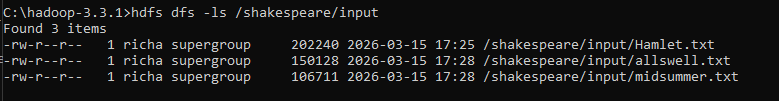
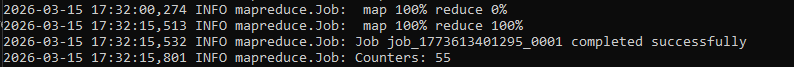
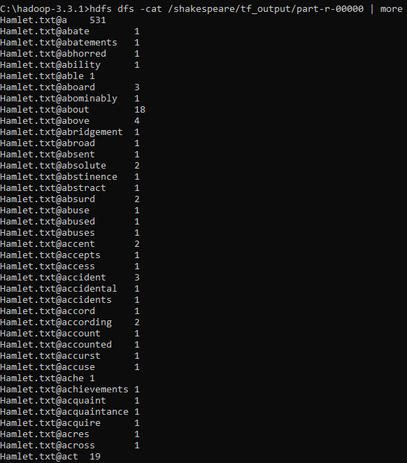
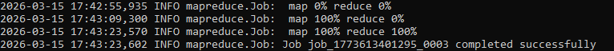
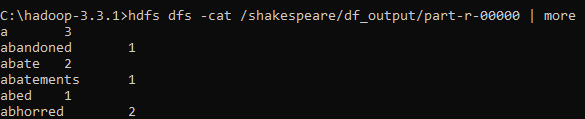
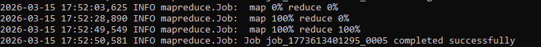
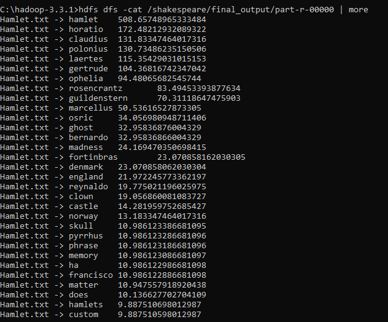

# Distributed Text Analytics with Hadoop MapReduce

This project demonstrates a **distributed text analytics pipeline built with Hadoop MapReduce and Java**.  
The system processes a corpus of Shakespeare plays stored in **HDFS (Hadoop Distributed File System)** and computes **TF-IDF scores** to identify distinctive vocabulary within each play.

Technologies: Java, Hadoop, MapReduce, HDFS

The pipeline executes across multiple MapReduce jobs to demonstrate how large-scale text data can be processed in a distributed environment.

---

## Technologies Used

- Java
- Hadoop MapReduce
- HDFS
- Distributed Data Processing
- TF-IDF Text Analysis

---

## Dataset

The dataset consists of three Shakespeare plays:

- Hamlet
- All’s Well That Ends Well
- A Midsummer Night’s Dream

Each play is uploaded into HDFS and processed as a separate document in the corpus.

---

## Processing Pipeline

The text analytics workflow is implemented using three MapReduce stages.

### 1. Term Frequency (TF)

The first MapReduce job counts how many times each word appears in each document.

Output format:

```
document@word count
```

Example:

```
Hamlet.txt@ghost 65
Hamlet.txt@king 120
```

This stage measures **how important a word is within a single document**.

---

### 2. Document Frequency (DF)

The second MapReduce job determines how many documents contain each word.

Output format:

```
word document_count
```

Example:

```
ghost 1
king 3
```

This stage measures **how common a word is across the entire corpus**.

---

### 3. TF-IDF Calculation

The final MapReduce job combines TF and DF values to compute TF-IDF scores.

TF-IDF formula:

```
TF-IDF = TF * log(N / DF)
```

Where:

- TF = term frequency within the document  
- DF = number of documents containing the term  
- N = total number of documents in the corpus  

The system outputs the **top 50 most distinctive terms per play**.

---

## Understanding the Output

The final TF-IDF output identifies words that are both:

- frequent within a specific play
- relatively uncommon across the other plays in the corpus

This means the system is not simply finding the most common words overall. Instead, it highlights terms that are more **distinctive** to each individual document.

Example output:

```
Hamlet.txt -> hamlet     508.66
Hamlet.txt -> horatio    172.48
Hamlet.txt -> claudius   131.83
Hamlet.txt -> ophelia     94.48
```

### What these results mean

- **hamlet** receives a very high TF-IDF score because it appears often in *Hamlet* and is strongly associated with that play.
- **horatio**, **claudius**, and **ophelia** also score highly because they are important character names that occur frequently in *Hamlet* but rarely in the other plays.
- A common word such as **the** or **and** would receive a much lower TF-IDF value because it appears in all documents and is not distinctive.

In other words, the final output helps identify the vocabulary that best characterizes each play.

---

## Hadoop Execution

### Term Frequency Job

```
hadoop jar ShakespeareTFIDF.jar TFDriver /shakespeare/input /shakespeare/tf_output
```

### Document Frequency Job

```
hadoop jar ShakespeareTFIDF.jar DFDriver /shakespeare/tf_output /shakespeare/df_output
```

### TF-IDF Job

```
hadoop jar ShakespeareTFIDF.jar TFIDFDriver /shakespeare/tf_output /shakespeare/df_output /shakespeare/final_output
```

---

## How to Run

### Prerequisites

Before running this project, ensure the following are installed and configured:

- Java 8 or compatible JDK
- Hadoop
- HDFS
- A compiled JAR file containing the project classes

Hadoop services must be running before executing the jobs.

---

### Upload Dataset to HDFS

Create an input directory:

```
hdfs dfs -mkdir -p /shakespeare/input
```

Upload the text files:

```
hdfs dfs -put Hamlet.txt /shakespeare/input
hdfs dfs -put allswell.txt /shakespeare/input
hdfs dfs -put midsummer.txt /shakespeare/input
```

Verify upload:

```
hdfs dfs -ls /shakespeare/input
```

---

### Run the MapReduce Pipeline

Run the three jobs sequentially.

Term Frequency:

```
hadoop jar ShakespeareTFIDF.jar TFDriver /shakespeare/input /shakespeare/tf_output
```

Document Frequency:

```
hadoop jar ShakespeareTFIDF.jar DFDriver /shakespeare/tf_output /shakespeare/df_output
```

TF-IDF Calculation:

```
hadoop jar ShakespeareTFIDF.jar TFIDFDriver /shakespeare/tf_output /shakespeare/df_output /shakespeare/final_output
```

View final output:

```
hdfs dfs -cat /shakespeare/final_output/part-r-00000
```

---

### Output Directories

The pipeline produces three HDFS directories:

```
/shakespeare/tf_output
/shakespeare/df_output
/shakespeare/final_output
```

If rerunning the pipeline, remove old outputs first:

```
hdfs dfs -rm -r /shakespeare/tf_output
hdfs dfs -rm -r /shakespeare/df_output
hdfs dfs -rm -r /shakespeare/final_output
```

---

## Execution Screenshots

### Dataset Uploaded to HDFS



---

### MapReduce Job 1 – Term Frequency



---

### Term Frequency Output



---

### MapReduce Job 2 – Document Frequency



---

### Document Frequency Output



---

### MapReduce Job 3 – TF-IDF Calculation



---

### Final TF-IDF Results



---

## Project Structure

```
shakespeare-hadoop-tfidf
│
├── src
│   ├── TFMapper.java
│   ├── TFReducer.java
│   ├── TFDriver.java
│   ├── DFMapper.java
│   ├── DFReducer.java
│   ├── DFDriver.java
│   ├── TFIDFMapper.java
│   ├── TFIDFReducer.java
│   └── TFIDFDriver.java
│
├── screenshots
│   ├── hdfs_dataset_upload.png
│   ├── mapreduce_tf_job_execution.png
│   ├── tf_output_directory.png
│   ├── tf_output_results.png
│   ├── mapreduce_df_job_execution.png
│   ├── df_output_results.png
│   ├── mapreduce_tfidf_job_execution.png
│   └── tfidf_final_results.png
│
└── README.md
```

---

## Key Takeaways

This project demonstrates:

- Distributed text processing with Hadoop MapReduce
- Multi-stage MapReduce pipelines
- HDFS data storage and data flow between jobs
- TF-IDF feature extraction for document analysis
- How distributed systems can analyze text corpora at scale

---

## Author

Richard Hanly
